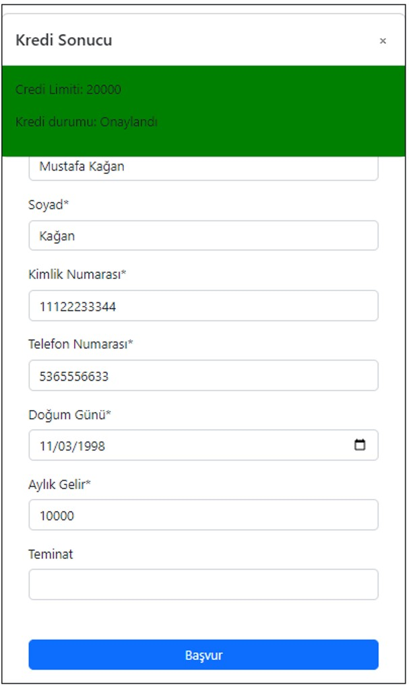
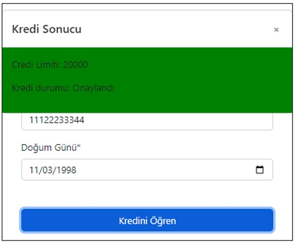
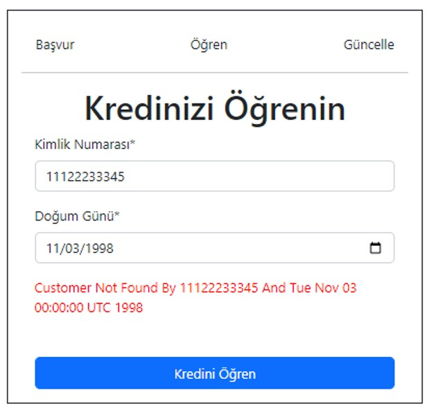
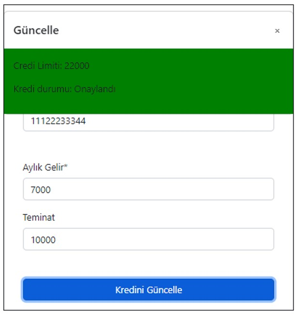
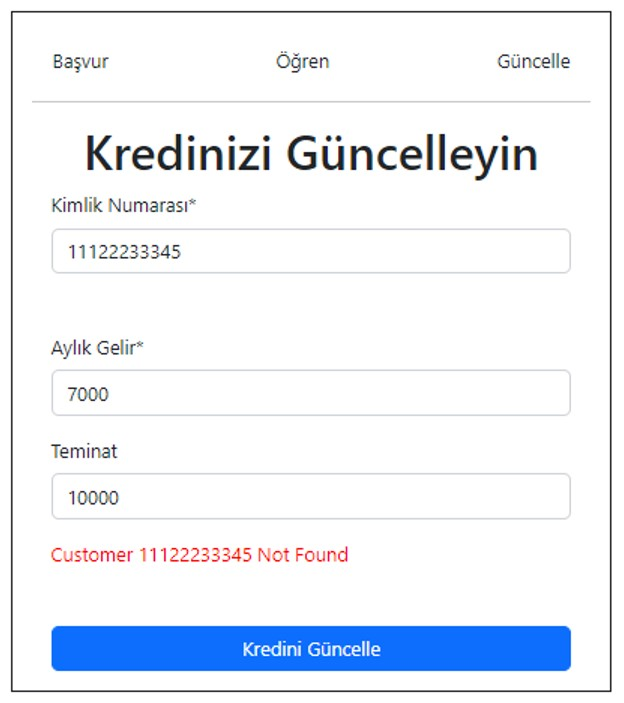

# HW3_WeatherApi
 Patika.dev DefineX Java Spring Practicum Final Case


## About Project
Writing a restful application for a loan application system, which will take the loan application requests and return the loan result to the customer according to the relevant criteria, using the Spring Boot framework and optionally writing the frontend.

* Java 17
* Maven
* Angular
* Postgresql

## Getting Started

This is an example of how you may give instructions on setting up your project locally. 
To get a local copy up and running follow these simple example steps.

## Project Content


identity number, name-surname, monthly income, phone information, date of birth and collateral (optional) , the credit score service is sent to the default credit score service, the credit score is taken and the credit result is returned to the user.

The Credit result will be returned according to the following conditions:

* If the credit score is below 500, the user will be rejected. (Credit result: Red)

* If the credit score is between 500 points and 1000 points and the monthly income is below 5000 TL, the loan application of the user is approved and a limit of 10.000 TL is allocated to the user. (Credit Result: Confirmation). If he has given collateral, 10% of the collateral amount is added to the credit limit.

* If the credit score is between 500 points and 1000 points and monthly income is between 5000 TL and 10,000 TL, the user's loan application is approved and a 20,000 TL limit is allocated to the user. (Credit Result: Approval) If a guarantee is given, 20 percent of the guarantee amount is added to the credit limit.

* If the credit score is between 500 points and 1000 points and the monthly income is over 10,000 TL, the user's loan application is approved and the user is given a MONTHLY INCOME INFORMATION * CREDIT LIMIT MULTIPLIER/2 limit. (Credit Result: Approval) In case of collateral, 25 percent of the collateral amount is added to the credit limit.

* If the credit score is 1000 points or more, the user is assigned a limit equal to MONTHLY INCOME * CREDIT LIMIT MULTIPLIER. (Credit Result: Approval) In case of collateral, 50 percent of the collateral amount is added to the credit limit.


### Installation

1. Clone the repo
```
git clone https://github.com/MustafaKaganSimsek/DefineX-Practicum-Final-Case.git
```
### Usage

1. go to folder of the project
```
cd .../DefineX-Practicum-Final-Case
```
2. run project with Docker
```
docker-compose up
```
3. You can use swagger or frontend app

* Swagger -> http://localhost:8080/swagger-ui/index.html
* Frontend -> http://localhost:9000/

### Screenshot






